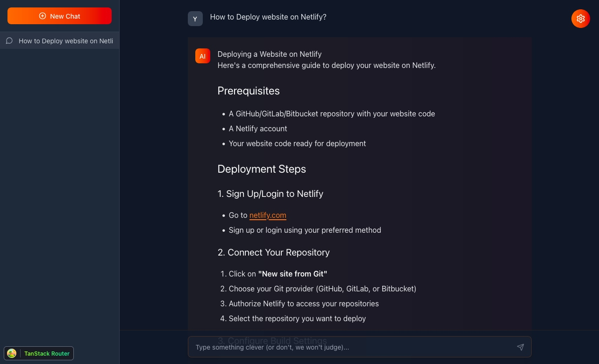

# TanStack Chat Template



A modern chat template built with TanStack Router and Claude AI integration features a clean and responsive interface.

**⚡ View demo:** [https://tanstack-starter.netlify.app/](https://tanstack-starter.netlify.app/)

## Deploy to Netlify

Want to deploy immediately? Click this button

[](https://app.netlify.com/start/deploy?repository=https://github.com/netlify-templates/tanstack-template)

Clicking this button will create a new repo for you that looks exactly like this one, and sets that repo up immediately for deployment on Netlify.

## ✨ Features

### AI Capabilities
- 🤖 Powered by Claude 3.5 Sonnet 
- 📝 Rich markdown formatting with syntax highlighting
- 🎯 Customizable system prompts for tailored AI behavior
- 🔄 Real-time message updates and streaming responses

### User Experience
- 🎨 Modern UI with Tailwind CSS and Lucide icons
- 🔍 Conversation management
- 🔐 Secure API key management
- 📋 Markdown rendering with code highlighting

## Architecture

### Tech Stack
- **Frontend Framework**: React 19 with TanStack Start
- **Routing**: TanStack Router
- **State Management**: TanStack Store
- **Styling**: Tailwind CSS 4
- **AI Integration**: Anthropic's Claude API
- **Build Tool**: Vite 6 with Vinxi

### Prerequisites

- [Node.js](https://nodejs.org/) v20.9+
- (optional) [nvm](https://github.com/nvm-sh/nvm) for Node version management
- [Anthropic Claude API](https://www.anthropic.com/api)

## Getting Started

To run this application:

```bash
npm install
npm run dev
```

### Building For Production

To build this application for production:

```bash
npm run build
```

To preview the production build:

```bash
npm run serve
```

## Styling

This project uses [Tailwind CSS](https://tailwindcss.com/) v4 for styling.

## Error Monitoring

This project uses [Sentry](https://sentry.io) for error monitoring and performance tracking. Sentry integration is optional and the project will run normally without Sentry configuration.

To set up Sentry:

1. Create a `.env` file by copying `.env.example`
2. Add your Sentry DSN and Auth Token to the `.env` file

```bash
cp .env.example .env
```

Then edit your `.env` file with your Sentry credentials. If the Sentry environment variables are not defined, the application will run without error monitoring.

```
# .env file
VITE_SENTRY_DSN=your-sentry-dsn-here
SENTRY_AUTH_TOKEN=your-sentry-auth-token-here
```

## Add Anthropic API Key to .env file

You can generate and manage your Anthropic API keys through the [Anthropic Console](https://console.anthropic.com/login).

```
# .env file
VITE_ANTHROPIC_API_KEY=your_anthropic_api_key
```

## Routing
This project uses [TanStack Router](https://tanstack.com/router). The initial setup is a file based router. Which means that the routes are managed as files in `src/routes`.

### Adding A Route

To add a new route to your application just add another a new file in the `./src/routes` directory.

TanStack will automatically generate the content of the route file for you.

Now that you have two routes you can use a `Link` component to navigate between them.

### Adding Links

To use SPA (Single Page Application) navigation you will need to import the `Link` component from `@tanstack/react-router`.

```tsx
import { Link } from "@tanstack/react-router";
```

Then anywhere in your JSX you can use it like so:

```tsx
<Link to="/about">About</Link>
```

This will create a link that will navigate to the `/about` route.

More information on the `Link` component can be found in the [Link documentation](https://tanstack.com/router/v1/docs/framework/react/api/router/linkComponent).

### Using A Layout

In the File Based Routing setup the layout is located in `src/routes/__root.tsx`. Anything you add to the root route will appear in all the routes. The route content will appear in the JSX where you use the `<Outlet />` component.

Here is an example layout that includes a header:

```tsx
import { createRootRoute, Outlet } from '@tanstack/react-router'
import { TanStackRouterDevtools } from '@tanstack/router-devtools'

import { Link } from "@tanstack/react-router";

export const Route = createRootRoute({
  component: () => (
    <>
      <header>
        <nav>
          <Link to="/">Home</Link>
          <Link to="/about">About</Link>
        </nav>
      </header>
      <Outlet />
      <TanStackRouterDevtools />
    </>
  ),
})
```

The `<TanStackRouterDevtools />` component is not required so you can remove it if you don't want it in your layout.

More information on layouts can be found in the [Layouts documentation](https://tanstack.com/router/latest/docs/framework/react/guide/routing-concepts#layouts).

## Data Fetching

There are multiple ways to fetch data in your application. You can use the `loader` functionality built into TanStack Router to load the data for a route before it's rendered.

For example:

```tsx
const peopleRoute = createRoute({
  getParentRoute: () => rootRoute,
  path: "/people",
  loader: async () => {
    const response = await fetch("https://swapi.dev/api/people");
    return response.json() as Promise<{
      results: {
        name: string;
      }[];
    }>;
  },
  component: () => {
    const data = peopleRoute.useLoaderData();
    return (
      <ul>
        {data.results.map((person) => (
          <li key={person.name}>{person.name}</li>
        ))}
      </ul>
    );
  },
});
```

Loaders simplify your data fetching logic dramatically. Check out more information in the [Loader documentation](https://tanstack.com/router/latest/docs/framework/react/guide/data-loading#loader-parameters).

## State Management

This project uses TanStack Store for state management. The store files are located in the `src/store` directory.

Here's a simple example of how to use TanStack Store:

```tsx
import { useStore } from "@tanstack/react-store";
import { Store } from "@tanstack/store";

const countStore = new Store(0);

function Counter() {
  const count = useStore(countStore);
  return (
    <div>
      <button onClick={() => countStore.setState((n) => n + 1)}>
        Increment - {count}
      </button>
    </div>
  );
}
```

One of the many nice features of TanStack Store is the ability to derive state from other state. That derived state will update when the base state updates.

```tsx
import { useStore } from "@tanstack/react-store";
import { Store, Derived } from "@tanstack/store";

const countStore = new Store(0);

const doubledStore = new Derived({
  fn: () => countStore.state * 2,
  deps: [countStore],
});
doubledStore.mount();

function Counter() {
  const count = useStore(countStore);
  const doubledCount = useStore(doubledStore);

  return (
    <div>
      <button onClick={() => countStore.setState((n) => n + 1)}>
        Increment - {count}
      </button>
      <div>Doubled - {doubledCount}</div>
    </div>
  );
}
```

You can find out everything you need to know on how to use TanStack Store in the [TanStack Store documentation](https://tanstack.com/store/latest).

## Learn More

You can learn more about all of the offerings from TanStack in the [TanStack documentation](https://tanstack.com).
